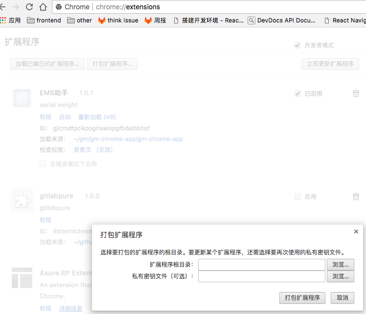

title: chrome app 杂谈
speaker: 李雅堂
url: https://github.com/gmfe/think

[slide]

# chrome app 杂谈

## by liyatang

[slide]

## 感悟

- 零碎的知识点，积累多了，经常在某个时刻串起来，思路突然打开。 {:&.rollIn}
- 碎片学习是有益的。
- 没想法时，去运动下，或许会豁然开朗

[slide]

## 背景

[slide]

pc称重的重构，痛点

- 历史悠久 {:&.rollIn}
- 迭代速度长
- 想象空间小

[slide]

## 选型

- 需要连电子秤，需要连热敏打印机。 未来可能会有更多的硬件设备接入。 {:&.rollIn}
- chrome app ? electron ?
- 因为 chrome app 会受 chrome api 限制。chrome app 这块用户教育程度难度大。且 google 在这的投入很少，未来据说会废弃掉。
- 从能力和用户角度上来说更偏向于 electron。
- 然而 electron 始终要回到 windows 下开发，哎...
- 所以 chrome app 先研究了。

[slide]

# 入门

- [chrome-app-scales](https://github.com/lmk123/chrome-app-scales) [chrome store](https://chrome.google.com/webstore/detail/%E8%AF%BB%E5%8F%96-usb-%E4%B8%8E%E4%B8%B2%E8%A1%8C%E6%8E%A5%E5%8F%A3%E8%AE%BE%E5%A4%87%E7%9A%84%E6%95%B0%E6%8D%AE/bbkdeoafljnanfgabbifaflcddhmljab?hl=zh-CN) {:&.rollIn}
- [官方 demo](https://github.com/googlearchive/chrome-app-samples)
- [中文文档](https://crxdoc-zh.appspot.com/apps/about_apps)
- 随 chrome 启动，会一直后台运行。

[slide]

# usb 设备

- 设备信息 vendorId productId {:&.rollIn}
- 设备类型 [interfaceclass](http://www.usb.org/developers/defined_class)
- [chrome usb log](chrome://device-log/)

[slide]

## String ArrayBuffer

- 和硬件的通信是 二进制。 {:&.rollIn}
- [JavaScript 类型化数据](https://developer.mozilla.org/en-US/docs/Web/JavaScript/Typed_arrays)
How-to-convert-ArrayBuffer-to-and-from-String https://developers.google.com/web/updates/2012/06/How-to-convert-ArrayBuffer-to-and-from-String

[slide]

## WebUSB

- chrome 61 新玩意 https://mp.weixin.qq.com/s/mKm03q4tLmAsNFsp7RWUGw {:&.rollIn}

[slide]

## mac windows 上的 usb list

- chrome app 提供设备列表的api，在 mac 可以找到热敏打印机，在 windows 下找不到了，可能被 windows 屏蔽了。 {:&.rollIn}
- mac 是使用 ESC TSC 协议里通信
- windows 是使用系统的打印能力，win下找不到打印设备单独连。

[slide]

# 打印

- 网页打印会出弹窗，怎么解决？ {:&.rollIn}
- 启动是加上参数 --kiosk-printing 可自动关闭弹窗。
- 出弹窗也难接受。通知 chrome app 做打印，打印时让 chrome app 隐藏，即可不获取焦点。
- 2~3s，难以接受。生成预览耗时长。最终废弃 chrome app 方案。

[slide]

网页打印难度：

- A4，二分纸，三分纸，标签，票据 {:&.rollIn}
- 下一页打印，页眉，页脚，边距
- 内容区域多自动下一页打，一块信息不跨页

[slide]

纯 css 可以做。
[gm-pdfmake](https://github.com/gmfe/gm-pdfmake)

[slide]

# 电子称

电子秤是用串口连接。串口的协议是最简单的，接入也很方便。

- 1 找到端口 2 连接 3 监听收数据。 {:&.rollIn}

[slide]

电子秤 push 的数据是很频繁的。

- 于是引入 中间变量 把流程断开。 {:&.rollIn}
- 一边电子秤不停的推送数据，并保存到中间变量上 weight。
- 一边调用方根据自己的节奏来取中间变量。

[slide]

串口还有很多难题

- 在 windows 下开发调试 {:&.rollIn}
- 串口占用话，chrome 没有提供 api 强清理掉
- 重启或借助第三方工具清理占用

[slide]

# 通信

chrome app 须声明可通信的域名。

```json
"externally_connectable": {
    "matches": [
        "*://station.guanmai.cn/*",
        "*://station.dev.guanmai.cn/*",
        "http://localhost:8787/*"
    ]
}
```

[slide]

分内部通信和外部通信。

```js
// 监听
chrome.runtime.onMessage.addListener ... // 省略
chrome.runtime.onMessageExternal.addListener((request, sender, sendResponse) => {
    const {type} = request;

    if (type === 'version') {
        sendResponse({
            code: 0,
            data: chrome.runtime.getManifest().version
        });
        return;
    }
});

// web
chrome.runtime.sendMessage('gjicmdfpcikpoginaeiopgfbdalbbhof', {type: 'version'}, res => console.log(res));

// inner
chrome.runtime.sendMessage({type: 'version'}, res => console.log(res));
```

- web 只可主动发起通信。假设某个操作需要异步。web 只能主动发起轮询查询异步结果。 {:&.rollIn}

[slide]

# chrome app 打包

<div>
    
</div>
记得保存好签名

[slide]

# 更新

storage 维护最新版本信息。

``` json
{
  "version": "1.0.1",
  "msg": "更新啦，更新啦",
  "url": "https://js.guanmai.cn/static_storage/json/chromeapp/app/gm-chrome-app.1.0.1.crx"
}
```

[slide]

# The End

## 谢谢